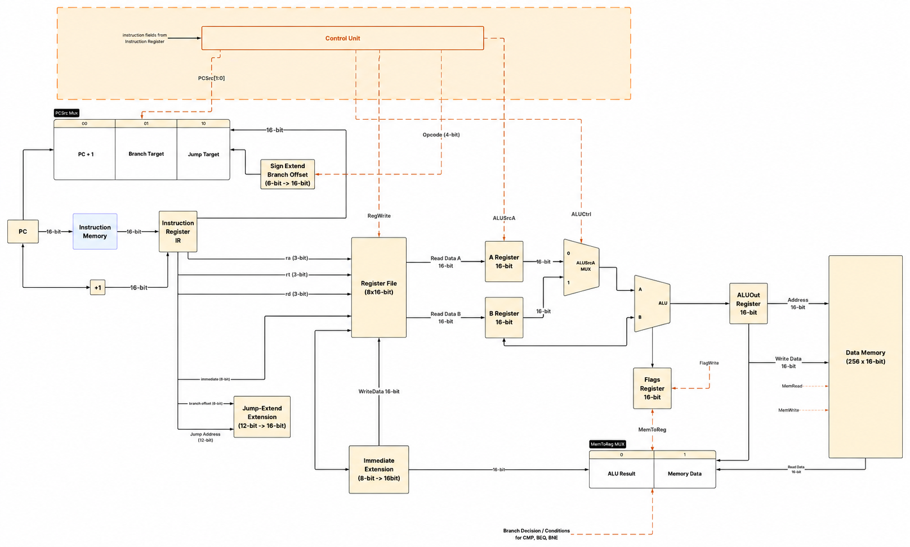

# Silicio-16

**A custom 16-bit multicycle processor designed and implemented from first principles.**

Silicio-16 is an educational CPU written in SystemVerilog. The project explores the complete path from instruction-set design to an integrated and verified RTL implementation, with an emphasis on a clear datapath, observable execution, and reproducible simulation.



## Architecture

| Feature | Specification |
| --- | --- |
| Data width | 16 bits |
| Instruction width | 16 bits |
| General-purpose registers | 8 × 16-bit |
| Execution model | Multicycle |
| Instruction memory | 256 × 16-bit |
| Data memory | 256 × 16-bit |
| RTL language | SystemVerilog |

The processor uses a centralized finite-state control unit and separate instruction and data memories. Its datapath includes the program counter, instruction register, register file, A/B registers, ALU, ALU output register, immediate extension unit, memory data register, flags register, and branch/jump logic.

## Instruction Set

Silicio-16 implements 16 instructions:

| Opcode | Instruction | Operation |
| :---: | --- | --- |
| `0x0` | `NOP` | No operation |
| `0x1` | `ADD` | Addition |
| `0x2` | `SUB` | Subtraction |
| `0x3` | `AND` | Bitwise AND |
| `0x4` | `OR` | Bitwise OR |
| `0x5` | `XOR` | Bitwise XOR |
| `0x6` | `SIM` | Bit-similarity count |
| `0x7` | `MOV` | Register move |
| `0x8` | `LDI` | Load immediate |
| `0x9` | `LOAD` | Load from data memory |
| `0xA` | `STORE` | Store to data memory |
| `0xB` | `CMP` | Compare registers and update flags |
| `0xC` | `BEQ` | Branch if equal |
| `0xD` | `BNE` | Branch if not equal |
| `0xE` | `JMP` | Unconditional jump |
| `0xF` | `HALT` | Stop execution |

Detailed instruction formats and execution cycles are available in [`docs/`](docs/).

## Verification

The RTL is verified with a self-checking CPU regression containing 30 checks across:

- Arithmetic and bitwise operations
- `SIM` and register movement
- Data-memory loads and stores
- Taken and not-taken branches
- Negative branch offsets
- Jump and NOP behavior
- HALT-state stability

Run the complete regression from the repository root:

```bash
chmod +x sim/run_regression.sh
./sim/run_regression.sh
```

A successful run ends with:

```text
Silicio-16 regression: 30 checks, 0 failures
[PASS] ALL SILICIO-16 RTL TESTS PASSED
```

## Fibonacci Demo

The included Fibonacci program executes a real loop and stores the first ten terms in data memory:

```text
RAM[0x20..0x29] = 0, 1, 1, 2, 3, 5, 8, 13, 21, 34
```

Run it with:

```bash
chmod +x sim/run_fibonacci.sh
./sim/run_fibonacci.sh
```

The testbench verifies every stored value and generates a VCD waveform for inspection.

## Repository Structure

```text
Silicio-16/
├── rtl/            # Synthesizable CPU modules
├── tb/             # Self-checking testbenches
├── sim/            # Programs and simulation scripts
├── docs/           # ISA, execution-cycle, and architecture documentation
├── Emulator MVP/   # Python emulator prototype
└── vcd/            # Waveform outputs
```

## Requirements

- [Icarus Verilog](https://steveicarus.github.io/iverilog/) with SystemVerilog support
- A VCD waveform viewer such as GTKWave or Simple Silicon

## Project Status

**RTL v1.0:** integrated and passing the complete regression suite.

Current development is focused on expanding demonstration programs, improving tooling, and adding a simulated framebuffer before future FPGA implementation.

## Authors

Developed by [Iker Garcia Morales](https://github.com/ikeermora) and [Roberto](https://github.com/yoyert29).
