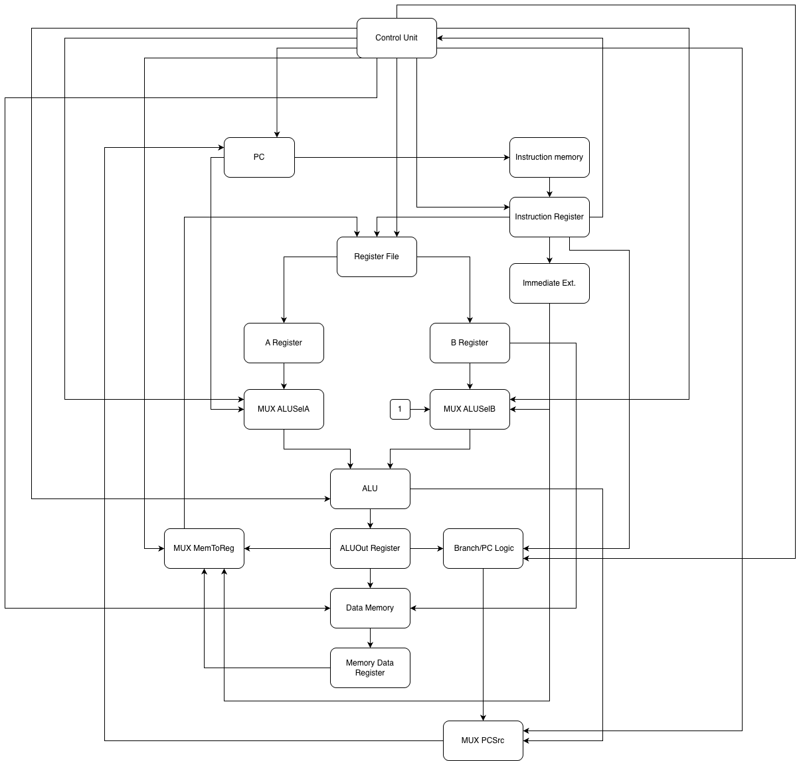

# List of Blocks that will form the Datapath

* Program Counter
* Instruction Memory
* Instruction Register
* Control Unit
* Register File
* ALU
* Data Memory
* Immediate Extension Unit
* Branch / PC Logic
* Multiplexers

## Hardware Blocks

### Program Counter
Purpose: Stores the address of the next instruction the CPU should execute. It should update to `PC + 1`. For jumps or branches, it should update to the new target address.

Inputs: 
- Clock: Updates the PC on each cycle
- Reset: Sets the PC back to the starting address
- Next PC value: The address that should be loaded into the PC
- PC write enable: Allows the PC to update.

Outputs: 
- Current PC Value: Sent to instruction memory as the instruction address.

### Instruction Memory
Purpose: Stores the program instructions. It receives the current PC value as an address and outputs the 16-bit instruction stored at that address

Inputs:
- Program Counter **(PC)**

Outputs: 
- 16-bit Instruction

### Instruction Register
Purpose: It keeps one instruction at a time frozen, so it does not change bits by accident. 

Inputs: 
- 16-bit instruction from Instruction Memory
- Clock
- Write Enable

Outputs: Current 16-bit instruction

### Control Unit
Purpose: It sends the control signals each clock cycle through the steps of execution of an instruction to the blocks across the datapath.

Inputs: 
- Clock
- Reset
- Opcode
- Funct
- Zero / ALU Flags

Outputs: 
- PCWrite
- IRWrite / WriteEnable
- RegWrite
- MemWrite
- MemRead
- ALUSelA / ALUSelB
- ALUOp
- PCSrc
- MemToReg

### Register File
Purpose: It operates as the storing space for the ALU operands. In each instruction, it allows for two source registers for reading and a destination register for writing. The readings are combinationals (asynchronous) and writing is synchronous and its conditioned by an enable signal from the control unit

Inputs: 
- Clock
- RegWrite
- Read Register 1
- Read Register 2
- Write Register
- Write Data

Outputs: 
- Read Data 1
- Read Data 2

### ALU
Purpose: Combinational block, its only purpose its to do mathematical calculations and logical operations such as: 
- Addition
- Subtraction
- AND
- OR
- XOR
It can also help calculate PC + 1 and branch target addresses.

Inputs: 
- Operand A
- Operand B
- ALU Control

Outputs: 
- ALU Result
- ALUOut
- Zero Flag

### Data Memory
Purpose: Storage reading element and synchronous writing. Data memory is exclusively used to keep volatile data that the program operates through instructions such as Load & Store.
 This blocks is only for active reading/writing and its controlled cyclically by the signals coming from the Control Unit.

Inputs:
-  Clock
- Address
- Write Data
- MemWrite 
- MemRead

Outputs: 
- Read Data

### Immediate Extension Unit
Purpose: Combinational block that transforms the immediate values coded into the instructions into data words with the complete size of the processor. It adjusts the width of bits, and it ensures to preserve the math sign either positive or negative. 

Inputs: 
- Instruction Bits
- ImmSrc

Outputs: 
- Extended Immediate

### Branch / PC Logic
Purpose: Calculates and selects the next PC value.

Inputs:
- PCSrc
- PCWrite
- PCWriteCond
- ALU Zero Flag
- PC + 1
- Branch target
- Jump target

Outputs:
- Next PC value

### Multiplexers
Purpose: They act as selectors of combinational data, they are in charge of directing the flow of information through the datapath. Their main purpose is to allow that only one port of entry of a component (such as the entry of the ALU) receives data from different sources according to the stage of the cycle of the current execution (Fetch, Decode, Execute, Etc.). Optimizing the use of hardware.

Inputs: 
- Data Input 0
- Data Input 1
- Optional additional data inputs
- Select signal from the Control Unit

Outputs:
- Selected data output 

---

Main multiplexers used in Silicio-16:

- `ALUSelA`: selects the first ALU operand.
- `ALUSelB`: selects the second ALU operand.
- `PCSrc`: selects the next PC value.
- `MemToReg`: selects the data written back to the Register File.
- `RegDst`: selects the destination register field.

## Datapath Schematic

